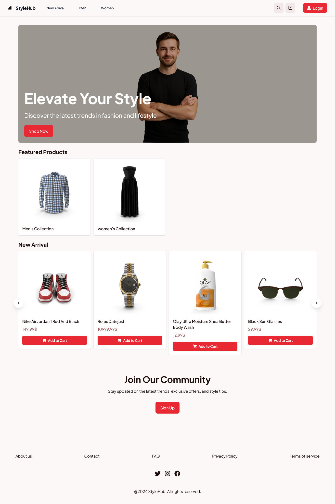

# Style Store

### Overview

personal project Full-stack e-commerce platform built with MERN stack. Features user authentication, product management, secure payments with Stripe, and a responsive design for seamless shopping experience



### How to Use the Project

this is style store, you can create you account fill your cart and make checkout you can also make some configuration by uploading profile picture, change password and looking on your previous order, you can login using your google account or signing up, there is search functionality to search product and filter products to choose one and you can comment product if you are logged in

### Technologies Used

- Frontend: React, Tailwind, Axios
- Backend: Node.js, Express.js
- Database: MongoDB
- Authentication: JWT, Google OAuth
- Payment: Stripe
- File Upload: Multer, Cloudinary
- Deployment: Vercel

### Key Features

- User Authentication (Email/Password & Google OAuth)
- Product Search & Filtering
- Shopping Cart & Checkout
- Stripe Payment Integration
- User Profile Management
- Order History
- Product Reviews & Comments
- Image Upload (Profile Pictures)
- Responsive Design

## Installation

### Prerequisites
- Node.js (v14 or higher)
- MongoDB (local installation or MongoDB Atlas)
- Git

### Clone the Repository
```bash
git clone https://github.com/your-username/your-repo-name.git
cd your-repo-name
```

### Backend Setup

1. Navigate to the server directory:
```bash
cd server
```

2. Install dependencies:
```bash
npm install
```

3. Create a `.env` file in the server directory and add the following variables:
```env
PORT=8000
MONGODB_URI=your_mongodb_connection_string
CLIENT_URL=http://localhost:3000
JWT_SECRET=your_jwt_secret_key
GOOGLE_CLIENT_ID=your_google_client_id
GOOGLE_CLIENT_SECRET=your_google_client_secret
STRIPE_SECRET_KEY=your_stripe_secret_key
ENDPOINT_WEBHOOK_SECRET=your_stripe_webhook_secret
CLOUDINARY_URL=your_cloudinary_url
HASH_SALT=your_hash_salt_rounds
GMAIL_SMTP_PASSWORD=your_gmail_app_password
```

4. Start the backend server:
```bash
npm run dev
```

### Frontend Setup

1. Open a new terminal and navigate to the client directory:
```bash
cd client
```

2. Install dependencies:
```bash
npm install
```

3. Create a `.env.local` file in the client directory and add:
```env
NEXT_PUBLIC_BASE_URL=http://localhost:8000
NEXT_PUBLIC_STRIPE_CLIENT_SECRET=your_stripe_publishable_key
```

4. Start the frontend development server:
```bash
npm run dev
```

### Access the Application

- Frontend: http://localhost:3000
- Backend API: http://localhost:8000

### Notes
- Make sure both servers are running simultaneously
- The backend runs on port 8000 and frontend on port 3000 by default
- Ensure MongoDB is running before starting the backend server

### Live Demo

**Website:** [https://style--store.vercel.app](https://style--store.vercel.app)
**Repository:** [https://github.com/Omar-Yasser-Frontend/stye-store-e-commerce](https://github.com/Omar-Yasser-Frontend/stye-store-e-commerce)

### Contact

**LinkedIn:** [Omar Yasser](https://www.linkedin.com/in/omar-yasser-2440aa262)